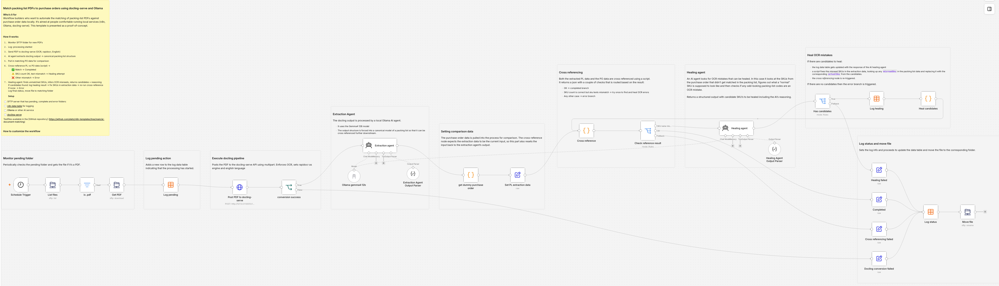

# Match packing list PDFs to purchase orders using docling-serve and Ollama

**Who’s it for**

Workflow builders who want to automate the matching of packing-list PDFs against purchase order data locally. It's aimed at people comfortable running local services (n8n, Ollama, docling-serve). This template is presented as a proof-of-concept.

**How it works / What it does**
It picks up scanned purchase order PDF files from SFTP and uses docling and Ollama to cross reference the extracted data with purchase orders. It also self heals simple OCR errors.

1. **Monitor pending folder.**
   It periodically checks a SFTP folder for new PDF files.
1. **Log pending action**
   Adds a new row to the log data table indicating that the processing has started.
1. **Execute docling pipeline**
   Posts the PDF to the docling-serve API using multipart. Enforces OCR, sets rapidocr as engine and english language.
1. **Extraction Agent**
   The docling output is processed by a local Ollama AI agent. The output structure is forced into a canonical model of a packing list so that it can be cross referenced further downstream.
1. **Setting comparison data**
   The purchase order data is pulled into the process for comparison. The cross-reference node expects the extraction data to be the current input, so this part also resets the input back to the extraction agent's output.
1. **Cross referencing**
   Both the extracted PL data and the PO data are cross referenced using a script.
   It returns a json with a couple of checks that is routed based on the result:
   1. OK -> completed branch
   1. SKU count is correct but sku texts mismatch -> try once to find and heal OCR errors
   1. Any other case -> error branch
1. **Healing agent**
   An AI agent looks for OCR mistakes that can be healed. In this case it looks at the SKUs from the purchase order that didn't get matched in the packing list, figures out what a "normal" SKU is supposed to look like and then checks if any odd-looking packing-list codes are an OCR mistake. Returns a structured output with candidate SKU's to be healed including the AI's reasoning.
1. **Heal OCR mistakes**
   If there are candidates to heal:
   1. the log data table gets updated with the response of the AI healing agent
   1. a script fixes the misread SKUs in the extraction data, looking up any `misreadSku` in the packing list data and replacing it with the corresponding `actualSku` from the candidates.
   1. the _cross referencing_ node is re-triggered.
   1. If there are no candidates then the error branch is triggered.
1. **Log status and move file**
   Sets the log info and proceeds to update the data table and move the file to the corresponding folder.

**How to set up**

- You will need a (S)FTP server setup with 3 folders:
  - pending
  - completed
  - failed
- [n8n data table](https://docs.n8n.io/build/work-with-data/data-tables) named "document_processor_log" for logging
- [Ollama](https://ollama.com/) or other AI service
- [docling-serve ](https://github.com/docling-project/docling-serve/tree/main)

**How to customize the workflow**

1. Change the credentials for:
   - Ollama in Agent nodes.
   - FTP Nodes
1. The move file FTP Node uses the status in lowercases as folder name. If the folder names on the (S)FTP server are not completed, failed, error then change the leading set nodes that feed this node.
1. Doublecheck data table name in all datatable nodes if you chose a different name.
1. Change docling-serve endpoint in HTTP node named "Post PDF to docling-serve"

# Files overview

```
├── README.md - You are here!
├── template.json - the template
├── test-files/
│ ├── packing-lists/ - PDF files used for testing
│ └── purchase-orders/ - Json file with mocked purchase order data
├── assets/
│ └── workflow-screenshot.png - screenshot of the workflow
│ └── n8n-pl-json-schema.json - Packing list json schema used in the template.
└── LICENSE
```

# Detailed writeup

Intereseted in all the details behind this workflow? See my [blog post!](https://data-integration.dev/posts/ai-document-matching-p3/)
